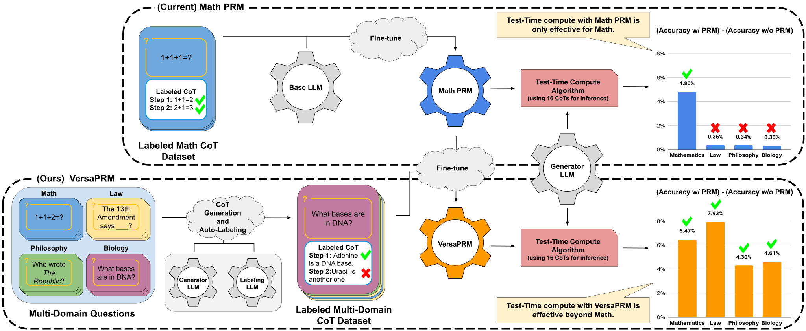

# VersaPRM: Multi-Domain Process Reward Model via Synthetic Reasoning Data

## Abstract

Process Reward Models (PRMs) have proven effective at enhancing mathematical reasoning for Large Language Models (LLMs) by leveraging increased inference-time computation. However, they are predominantly trained on mathematical data and their generalizability to non-mathematical domains has not been rigorously studied. In response, this work first shows that current PRMs have poor performance in other domains. To address this limitation, we introduce **_VersaPRM_**, a multi-domain PRM trained on synthetic reasoning data generated using our novel data generation and annotation method. VersaPRM achieves consistent performance gains across diverse domains. For instance, in the MMLU-Pro category of Law, VersaPRM via weighted majority voting, achieves a 7.9% performance gain over the majority voting baseline---surpassing Qwen2.5-Math-PRM's gain of 1.3%. We further contribute to the community by open-sourcing all data, code and models for VersaPRM.

Link to paper (TODO: Add link)

## 🚀 Models
We provide several **VersaPRM models** and **PRM-enhanced versions** of standard architectures, trained with different configurations.

### 📌 [VersaPRM Collection](https://huggingface.co/UW-Madison-Lee-Lab/VersaPRM)
A suite of **VersaPRM** models trained with various configurations:
- **[VersaPRM-Base-8B](https://huggingface.co/UW-Madison-Lee-Lab/VersaPRM-Base-8B)** – trained from llama-3.1-8b using MMLU-Pro-CoT-Train-Labeled
- **[VersaPRM-Aug](https://huggingface.co/UW-Madison-Lee-Lab/VersaPRM-Aug)** – Trained with augmented data for improved generalization.
- **[VersaPRM-Small-Subset](https://huggingface.co/UW-Madison-Lee-Lab/VersaPRM-Small-Subset)** – A lightweight model for quick inference.
- **[VersaPRM-Math-Subset](https://huggingface.co/UW-Madison-Lee-Lab/VersaPRM-Math-Subset)** – Specialized trained on MMLU-Pro Math subset.

### 📌 PRM-Enhanced Models
- **[Qwen-PRM800K](https://huggingface.co/UW-Madison-Lee-Lab/Qwen-PRM800K)** – Fine-tuned **Qwen model** by PRM800K
- **[Llama-PRM800K](https://huggingface.co/UW-Madison-Lee-Lab/Llama-PRM800K)** – Fine-tuned **LLaMA model** by PRM800K

---

## 📊 Datasets

### 📌 [MMLU-Pro-CoT-Eval](https://huggingface.co/datasets/UW-Madison-Lee-Lab/MMLU-Pro-CoT-Eval)
- **Size:** 249k rows
- **Use Case:** Evaluation cots generated llama-3.1-8b-instruct, sampled 128 responses for each question. (Some question have less as we remove CoT for which cannot extract final answer)

### 📌 [MMLU-Pro-CoT-Train-Labeled](https://huggingface.co/datasets/UW-Madison-Lee-Lab/MMLU-Pro-CoT-Train-Labeled)
- **Size:** 84.1k rows
- **Use Case:** Stepwise Labeled CoT training dataset used to finetune VersaPRM. The CoT are generated by llama-3.1-8b-Instruct, with 16 responses sampled for each question. (Some question have less as we remove invalid CoTs)

---

## Folder Structure

- `aws_batch_inference/`: Scripts for performing batch inference using AWS services.
- `counterfactual_augmentation/`: Scripts for creating and processing counterfactual augmentation batches.
- `evaluation/`: Scripts and resources for evaluating model performance, including metric calculations and batch output merging.
- `figures/`: Contains visual representations and figures used in the project.
- `model_train/`: Scripts and configurations for training models, including data preparation and training scripts.
- `search_algs/`: Scripts for running beam search and MCTS (TODO: add readme).
- `synth_cot_generation/`: Scripts for generating synthetic chain-of-thought (CoT) data for training and evaluation.

